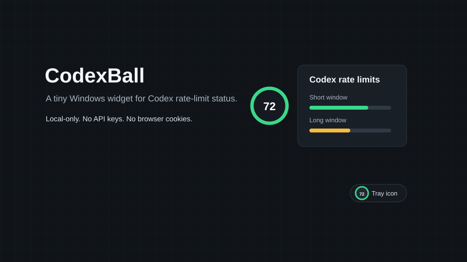

# CodexBall

[](https://github.com/qianfeiqianlan/CodexBall/actions/workflows/build-test.yml)
[](LICENSE)

CodexBall is a Windows-first desktop widget for keeping an eye on Codex rate-limit status.

It runs as a small 64 x 64 WPF floating ball, can hide near the screen edge, and shows a tray icon with the current short-window remaining percentage while Codex is active.



## Features

- Floating always-on-top status ball.
- Details popup for short and long rate-limit windows.
- System tray icon with refresh, show, and exit actions.
- Optional launch-at-startup toggle.
- Edge-hide behavior for a lightweight desktop presence.
- Local settings stored under `%LOCALAPPDATA%\CodexBall\settings.json`.

## Requirements

- Windows.
- .NET 9 SDK.
- Codex installed and available from the command line.
- A local Codex login already configured.

CodexBall talks to Codex by launching:

```powershell
codex app-server --stdio
```

It reuses the local Codex login state that the official Codex tooling already uses.

## Build, Test, And Run

```powershell
dotnet build
dotnet test
dotnet run --project .\CodexBall.App
```

## Download

For published builds, download the latest `CodexBall-*-win-x64.zip` from GitHub Releases, unzip it, and run `CodexBall.exe`.

Windows may show a SmartScreen warning for unsigned community builds. Check that the zip came from this repository's Releases page before running it.

## Privacy And Security Boundaries

CodexBall is intentionally small and local:

- It does not ask for API keys.
- It does not read browser cookies.
- It does not read private token files directly.
- It does not call private web APIs.
- It does not run a backend service or database.
- It does not attempt to bypass, increase, or alter Codex rate limits.
- It only displays rate-limit information returned by the local Codex app server.

The app stores its own lightweight UI preferences locally in `%LOCALAPPDATA%\CodexBall\settings.json`.

## Current Scope

CodexBall is an MVP desktop utility. The project is currently Windows-first because the UI is implemented with WPF. Cross-platform UI support, installers, charts, and richer usage analytics are intentionally outside the initial scope.

## Development Notes

The project is split into:

- `CodexBall.App`: WPF UI, tray integration, window behavior, settings, and view models.
- `CodexBall.Core`: Codex process startup, JSON-RPC, protocol parsing, and formatting helpers.
- `CodexBall.Tests`: focused tests for parsing and formatting behavior.

Keep Codex protocol details in `CodexBall.Core`; WPF code should consume view models and core models.

## License

CodexBall is released under the MIT License.
